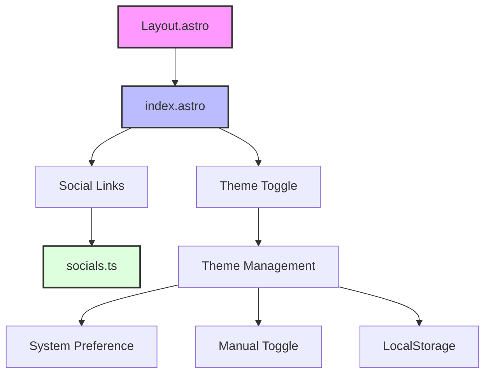

# Personal Portfolio Website

A modern, responsive personal portfolio website built with Astro 5, TailwindCSS, and TypeScript. Features dark mode support, dynamic social media links, and a clean, minimalist design.

## 🌟 Features

- 🎨 **Responsive Design**: Mobile-first approach with a clean, modern interface
- 🌓 **Dark/Light Mode**: System-preference detection with manual toggle option
- 🔗 **Dynamic Social Links**: Centralized configuration for easy management
- ⚡ **Performance Focused**: Built with Astro for optimal loading speeds
- 🎯 **Accessibility**: Screen reader support and semantic HTML
- 🛠 **Type Safety**: TypeScript integration for better development experience

## 🏗 Architecture



## 📁 Project Structure

```
/
├── public/
│   └── favicon.svg
├── src/
│   ├── layouts/
│   │   └── Layout.astro (Base layout with navigation and theme toggle)
│   ├── pages/
│   │   └── index.astro (Homepage with profile and social links)
│   ├── config/
│   │   └── socials.ts (Social media configuration)
│   └── styles/
│       └── global.css (Global styles)
├── astro.config.mjs (Astro configuration)
├── tailwind.config.mjs (Tailwind CSS configuration)
├── package.json
└── README.md
```

## 🚀 Getting Started

1. **Clone the repository**
   ```bash
   git clone https://github.com/yourusername/portfolio-website.git
   cd portfolio-website
   ```

2. **Install dependencies**
   ```bash
   npm install
   ```

3. **Configure social media links**
   Edit `src/config/socials.ts`:
   ```typescript
   export const socials: Social[] = [
     {
       platform: 'github',
       url: 'https://github.com/yourusername',
       icon: 'fab fa-github',
       label: 'GitHub'
     },
     // Add more social links...
   ];
   ```

4. **Start development server**
   ```bash
   npm run dev
   ```

## 🛠 Core Components

### Layout (Layout.astro)
- Base template for all pages
- Implements navigation and theme toggle
- Handles dark mode functionality
- Responsive design implementation

### Homepage (index.astro)
- Main landing page
- Profile section
- Dynamic social media links rendering
- Responsive layout adjustments

### Social Media Configuration (socials.ts)
- TypeScript interface for social media entries
- Centralized configuration for all social links
- Easy to extend and modify

### Theme Management
- System preference detection
- Manual theme toggle
- Persistent theme selection using localStorage
- Tailwind dark mode integration

## 🎨 Customization

### Adding New Social Media Links
1. Open `src/config/socials.ts`
2. Add a new entry to the `socials` array:
   ```typescript
   {
     platform: 'newplatform',
     url: 'https://newplatform.com/username',
     icon: 'fab fa-newplatform',
     label: 'Platform Name'
   }
   ```

### Modifying Theme Colors
1. Open `tailwind.config.mjs`
2. Customize the theme section:
   ```javascript
   theme: {
     extend: {
       colors: {
         // Add your custom colors
       }
     }
   }
   ```

## 🧞 Available Commands

| Command                   | Action                                           |
| :----------------------- | :----------------------------------------------- |
| `npm install`            | Installs dependencies                            |
| `npm run dev`            | Starts local dev server at `localhost:4321`      |
| `npm run build`          | Build your production site to `./dist/`          |
| `npm run preview`        | Preview your build locally before deploying      |

## 🔧 Technical Details

### Dependencies
- **Astro**: Static site generator
- **TailwindCSS**: Utility-first CSS framework
- **TypeScript**: Type safety and better developer experience
- **Font Awesome**: Icon library

### Browser Support
- Modern browsers (Chrome, Firefox, Safari, Edge)
- Responsive design works on all screen sizes
- Progressive enhancement approach

## 📚 Resources

- [Astro Documentation](https://docs.astro.build)
- [TailwindCSS Documentation](https://tailwindcss.com/docs)
- [Font Awesome Icons](https://fontawesome.com/icons)

## 🤝 Contributing

1. Fork the repository
2. Create your feature branch (`git checkout -b feature/AmazingFeature`)
3. Commit your changes (`git commit -m 'Add some AmazingFeature'`)
4. Push to the branch (`git push origin feature/AmazingFeature`)
5. Open a Pull Request

## 📝 License

This project is open source and available under the [MIT License](LICENSE).
