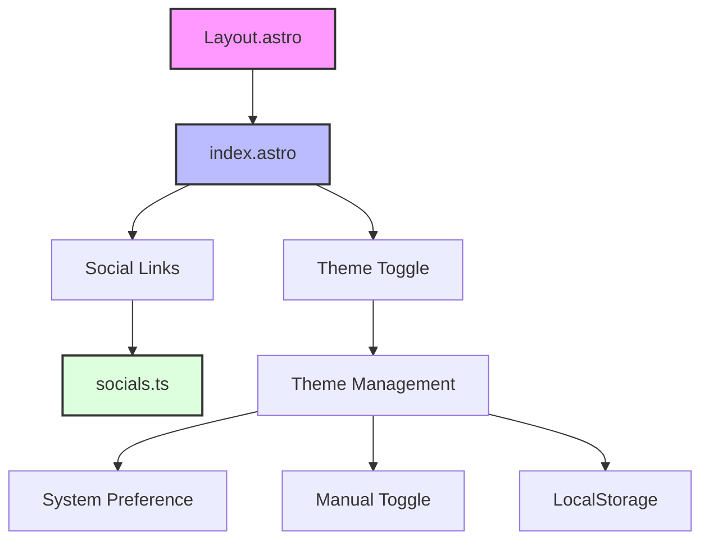

# Personal Portfolio Website

A modern, responsive personal portfolio website built with Astro 5, TailwindCSS, and TypeScript. Features dark mode support, dynamic social media links, and a clean, minimalist design with optimized performance.

## 🌟 Features

- 🎨 **Responsive Design**: Mobile-first, clean UI with TailwindCSS
- 🌓 **Dark/Light Mode**: System preference + manual toggle without flashes
- 🔗 **Dynamic Social Links**: Centralized in `src/config/socials.ts`
- 🖼️ **Images via astro:assets**:
  - `ResponsiveImage.astro` wraps `Picture` for AVIF/WebP + original fallback
  - SVG/string paths fall back to `` automatically
  - Homepage avatar now uses `Picture` with responsive variants
- 🧩 **MDX Support**: Write content in `.mdx`, import images, and embed components
- 🐟 **Mermaid Diagrams**: Enabled using `rehype-mermaid` in Markdown
- ⚡ **Performance**: Minimal JS, code-splitting, responsive images
- 📦 **Caching & Headers**: Netlify headers auto-generated after build
- 🛠 **Type Safety**: TypeScript across content & components

## 🏗 Architecture



## 📁 Project Structure

```
/
├── public/
│   ├── images/
│   ├── fonts/
│   └── favicon.svg
├── scripts/
│   ├── optimize-images.js        # prebuild image optimization
│   ├── generate-headers.js       # postbuild Netlify _headers
│   └── fix-fonts.js
├── src/
│   ├── components/
│   │   ├── ResponsiveImage.astro
│   │   ├── FontOptimizer.astro
│   │   ├── SocialIcons.astro
│   │   └── Icons.astro
│   ├── content/
│   │   ├── blog/                  # .md or .mdx files
│   │   ├── projects/              # .md or .mdx files
│   │   └── config.ts              # collections schema
│   ├── images/
│   │   └── avatar.jpg             # homepage avatar (astro:assets)
│   ├── layouts/
│   │   ├── Layout.astro
│   │   ├── BlogPost.astro
│   │   └── ProjectPost.astro
│   ├── pages/
│   │   ├── index.astro
│   │   ├── blog.astro
│   │   ├── blog/[...slug].astro
│   │   ├── projects.astro
│   │   ├── projects/[...slug].astro
│   │   └── tags/[tag].astro
├── astro.config.mjs
├── netlify.toml
├── tailwind.config.mjs
├── package.json
└── README.md
```

## 🚀 Getting Started

1. **Clone the repository**

   ```bash
   git clone https://github.com/yourusername/portfolio-website.git
   cd portfolio-website
   ```

2. **Install dependencies**

   ```bash
   npm install
   ```

3. **Configure social media links**
   Edit `src/config/socials.ts`:

   ```typescript
   export const socials: Social[] = [
     {
       platform: 'github',
       url: 'https://github.com/yourusername',
       label: 'GitHub',
     },
     // Add more social links...
   ];
   ```

4. **Start development server**
   ```bash
   npm run dev
   ```

## 🛠 Core Components

### Performance Components

#### ResponsiveImage.astro

- High-level wrapper over `astro:assets` `Picture`
- Inputs `ImageMetadata | string`; auto-falls back to `` for SVG/string
- Responsive widths default: `[320, 480, 768, 1024, 1280]`
- Formats default: `['avif', 'webp']` plus original format fallback
- Props: `sizes?`, `widths?`, `formats?`, `loading?`, `fetchpriority?`

#### FontOptimizer.astro

- Font loading optimization
- Variable font support
- Loading state management
- Font fallback handling
- Performance monitoring

#### ScriptOptimizer.astro

- Third-party script management
- Priority-based loading
- Resource hint implementation
- Performance budgeting
- User interaction tracking

### Core Layout Components

### Layout (Layout.astro)

- Base template for all pages
- Implements navigation and theme toggle
- Handles dark mode functionality with optimized JavaScript
- Responsive design implementation

### Homepage (index.astro)

- Main landing page with optimized avatar via `Picture` (AVIF/WebP + responsive)
- Dynamic social links with inline SVG icons
- Responsive layout with dark mode

### Icons System (Icons.astro)

- Optimized SVG icons instead of external icon libraries
- Zero external dependencies for icons
- TypeScript-powered type safety for icon names
- Customizable through CSS classes
- Accessible and performant

### Social Media Configuration (socials.ts)

- TypeScript interface for social media entries
- Centralized configuration for all social links
- SVG icon integration
- Easy to extend and modify

### Theme Management

- Optimized theme switching with minimal JavaScript
- System preference detection
- Manual theme toggle
- Persistent theme selection using localStorage
- Prevents flash of incorrect theme

### Image Optimization (optimize-images.js)

- WebP format support with JPEG fallback
- Multiple sizes for responsive images (1x and 2x)
  - Proper width and height attributes to prevent layout shifts
  - Lazy loading for off-screen images
  - Sharp-powered image processing
- Automated optimization script

## 📝 Content Authoring (Blog & Projects with MDX)

Content lives in `src/content/blog/` and `src/content/projects/`, defined by `src/content/config.ts` with schema-validated frontmatter using `image()`.

- __Frontmatter schema__ (`src/content/config.ts`):
  - Blog: `title` (string), `date` (string), `heroImage` (image optional), `tags?`, `description?`
  - Projects: `title`, `description`, `date`, `heroImage?`, `tags?`, `github?`, `demo?`

- __Create a new blog post__
  1) Create a folder with media next to it (recommended):
     - `src/content/blog/my-post/index.mdx`
     - `src/content/blog/my-post/hero.jpg`
  2) In `index.mdx`:
     ```mdx
     ---
     title: My Post
     date: 2025-09-02
     heroImage: ./hero.jpg
     tags: [astro]
     ---

     import { Picture } from 'astro:assets';
     import ResponsiveImage from '../../components/ResponsiveImage.astro';
     import diagram from './diagram.png';

     Inline image via Picture:
     <Picture src={diagram} widths={[320,640,960,1280]} sizes="(min-width:768px) 768px, 100vw" formats={['avif','webp','png']} alt="Diagram" />

     Or via shared component:
     <ResponsiveImage src={diagram} alt="Diagram" sizes="(min-width:768px) 768px, 100vw" />
     ```

- __Create a new project__
  1) `src/content/projects/my-project/index.mdx`
  2) Frontmatter:
     ```md
     ---
     title: My Project
     description: Short summary
     date: 2025-09-02
     heroImage: ./hero.png
     github: https://github.com/you/repo
     demo: https://example.com
     ---
     ```

- __Hero images__
  - Store images next to the content file, reference with a relative path.
  - When schema `image()` resolves to `ImageMetadata`, the routes/layouts render with `ResponsiveImage.astro` (uses `Picture` under the hood). SVGs fall back to ``.

- __Routing__
  - Blog pages: `src/pages/blog/[...slug].astro` (uses `getCollection('blog')` and `post.render()`).
  - Project pages: `src/pages/projects/[...slug].astro`.

- __Mermaid diagrams__
  - Markdown/MDX diagrams are rendered server-side via `rehype-mermaid` configured in `astro.config.mjs`.

## 🔧 Performance Tools

### Build Tools

```bash
# Optimize images
node scripts/optimize-images.js

# Analyze bundle
npm run analyze

# Build with optimizations
npm run build
```

### Performance Monitoring

- Integrated with Core Web Vitals
- Real User Monitoring (RUM)
- Performance budget tracking
- Third-party impact monitoring

### Debug Tools

```bash
# View optimization metrics
npm run analyze

# Check bundle sizes
npm run build -- --debug
```

## 📦 Caching & Headers

Implemented via generated Netlify headers and hashed filenames:

- __Hashed assets__: `/assets/*` immutable for 1 year
- __Bundled JS__: `/chunks/*.js` and `/entry.*.js` immutable for 1 year
- __Fonts__: woff2 immutable for 1 year
- __HTML__: `max-age=0, must-revalidate`

How it works:
- `scripts/generate-headers.js` writes `dist/_headers` in `postbuild`
- Filenames include content hashes per `astro.config.mjs` rollup output settings

Modify headers:
- Edit `scripts/generate-headers.js`, rebuild. The old root `_headers` file was removed in favor of generated headers.

## 🐛 Browser Console Error Prevention

The website is designed to prevent common browser console errors:

### Script Loading Optimization

- **Progressive Loading**: Scripts are loaded in priority tiers (high, medium, low) to optimize page performance
- **Proper Variable Scoping**: All script variables are properly defined in their execution context
- **Error Handling**: Script loading includes proper error handling to prevent reference errors
- **Cookie Consent Integration**: Third-party scripts are only loaded after obtaining user consent

### Font Loading Optimization

- **Correct Font Weight Syntax**: Using numeric weights (e.g., `700`) instead of descriptive weights (e.g., `bold`)
- **Font Loading Error Handling**: Graceful fallback to system fonts if web fonts fail to load
- **Font Loading State Management**: Proper tracking of font loading state in localStorage

### CSS Syntax Fixes

- **Proper CSS Property Syntax**: Ensuring all CSS properties include required semicolons
- **Valid CSS Values**: Using valid CSS values for all properties including aspect-ratio

### Cookie and Privacy Compliance

- **Cookie Consent Banner**: User-friendly banner for obtaining cookie consent
- **Privacy Policy Page**: Detailed privacy policy explaining data collection practices
- **SameSite Cookie Handling**: Proper handling of third-party cookies with SameSite attributes
- **Conditional Script Loading**: Third-party scripts only load when consent is given

## 🎨 Customization

### Adding New Social Media Links

1. Open `src/config/socials.ts`
2. Add a new entry to the `socials` array:
   ```typescript
   {
     platform: 'newplatform',
     url: 'https://newplatform.com/username',
     label: 'Platform Name'
   }
   ```

### Adding Custom Icons

1. Open `src/config/icons.ts`
2. Add your SVG path:
   ```typescript
   export const Icons = {
     NewIcon: `<path d="..." />`,
   };
   ```

### Using Icons

```astro
<Icons name="NewIcon" class="h-6 w-6" />
```

### Modifying Theme Colors

1. Open `tailwind.config.mjs`
2. Customize the theme section:
   ```javascript
   theme: {
     extend: {
       colors: {
         // Add your custom colors
       }
     }
   }
   ```

## 🧞 Available Commands

| Command                           | Action                                      |
| :-------------------------------- | :------------------------------------------ |
| `npm install`                     | Installs dependencies                       |
| `npm run dev`                     | Starts local dev server at `localhost:4321` |
| `npm run build`                   | Build your production site to `./dist/`     |
| `npm run preview`                 | Preview your build locally before deploying |
| `node scripts/optimize-images.js` | Optimize and convert images                 |

## 🚀 Deployment

- Hosted on Netlify. Build command: `npm run build`; publish directory: `dist/`.
- Postbuild generates `dist/_headers` for caching (`scripts/generate-headers.js`).
- For local preview: `npm run preview`.

## 📊 Performance Metrics

### Core Web Vitals

- **LCP (Largest Contentful Paint)**: < 2.5s
- **FID (First Input Delay)**: < 100ms
- **CLS (Cumulative Layout Shift)**: < 0.1

### Additional Metrics

- **TTFB**: Optimized server response
- **FCP**: Fast first content paint
- **TTI**: Quick time to interactive

## 🔧 Technical Details

### Performance Optimizations

- **Images**:
  - WebP format with JPEG fallbacks
  - Responsive sizes (1x and 2x)
  - Proper width/height attributes
  - Lazy loading implementation
- **JavaScript**:
  - Minimal usage
  - Code splitting
  - Async loading where possible
  - Optimized theme switching
- **Icons**:
  - Inline SVGs instead of icon fonts
  - No external icon libraries
  - CSS-based styling
- **CSS**:
  - Purged unused styles
  - Minimal Tailwind imports
  - Efficient dark mode implementation
- **Caching**:
  - Proper cache headers for static assets
  - Local storage for user preferences

### Dependencies

- Core: `astro`, `@astrojs/tailwind`, `sharp`, `rehype-mermaid`, `date-fns`
- Dev: `@astrojs/mdx`, ESLint/Prettier toolchain, TailwindCSS
- See `package.json` for exact versions.

### Performance Features

- **Astro**: Static site generator
- **TailwindCSS**: Utility-first CSS framework
- **TypeScript**: Type safety
- **Sharp**: Image optimization

### Optimization Configuration

#### Config highlights (astro.config.mjs)

```js
import mdx from '@astrojs/mdx';
import tailwind from '@astrojs/tailwind';

export default defineConfig({
  prefetch: true,
  integrations: [tailwind(), mdx()],
  build: {
    assets: 'assets',
    rollupOptions: {
      output: {
        entryFileNames: 'entry.[hash].js',
        chunkFileNames: 'chunks/[name].[hash].js',
        assetFileNames: 'assets/[name].[hash][extname]'
      }
    }
  },
  markdown: {
    rehypePlugins: [require('rehype-mermaid')]
  }
});
```

#### Image Optimization

```javascript
// scripts/optimize-images.js
module.exports = {
  quality: 80,
  formats: ['webp', 'avif'],
  sizes: [640, 768, 1024, 1280],
};
```

### Browser Support

- Modern browsers (Chrome, Firefox, Safari, Edge)
- Responsive design works on all screen sizes
- Progressive enhancement approach
- Fallbacks for older browsers

## 📚 Resources

- [Astro Documentation](https://docs.astro.build)
- [TailwindCSS Documentation](https://tailwindcss.com/docs)
- [Font Awesome Icons](https://fontawesome.com/icons)

## 🤝 Contributing

1. Fork the repository
2. Create your feature branch (`git checkout -b feature/AmazingFeature`)
3. Commit your changes (`git commit -m 'Add some AmazingFeature'`)
4. Push to the branch (`git push origin feature/AmazingFeature`)
5. Open a Pull Request

## 📝 License

This project is open source and available under the [MIT License](LICENSE).
