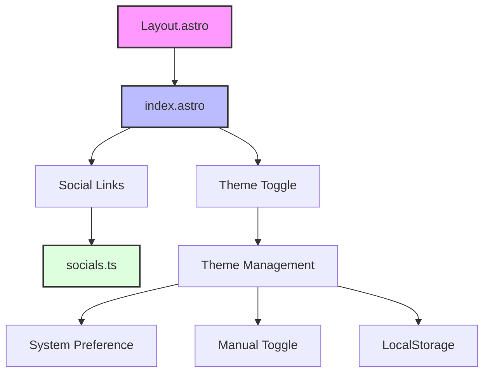

# Personal Portfolio Website

A modern, responsive personal portfolio website built with Astro 5, TailwindCSS, and TypeScript. Features dark mode support, dynamic social media links, and a clean, minimalist design with optimized performance.

## 🌟 Features

- 🎨 **Responsive Design**: Mobile-first approach with a clean, modern interface
- 🌓 **Dark/Light Mode**: System-preference detection with manual toggle option
- 🔗 **Dynamic Social Links**: Centralized configuration for easy management
- ⚡ **Performance Optimized**:
  - Optimized image loading with WebP support
  - Inline SVG icons for faster loading
  - Minimal JavaScript footprint
  - Code splitting and lazy loading
- 🎯 **Accessibility**: Screen reader support and semantic HTML
- 🛠 **Type Safety**: TypeScript integration for better development experience
- 📦 **Efficient Caching**: Optimized cache policies for static assets to improve performance
- 🍪 **Cookie Consent**: GDPR-compliant cookie consent mechanism for third-party scripts
- 🔧 **Browser Compatibility**: Fixes for common browser console errors and warnings

## 🏗 Architecture



## 📁 Project Structure

```
/
├── public/
│   ├── images/
│   │   └── [optimized images]
│   └── scripts/
│       └── theme.js
├── src/
│   ├── layouts/
│   │   └── Layout.astro
│   ├── pages/
│   │   ├── index.astro
│   │   └── resume.astro
│   ├── components/
│   │   ├── Icons.astro
│   │   └── SocialIcons.astro
│   ├── config/
│   │   ├── socials.ts
│   │   └── icons.ts
│   └── scripts/
│       └── theme.js
├── scripts/
│   └── optimize-images.js
├── astro.config.mjs
├── tailwind.config.mjs
├── package.json
└── README.md
```

## 🚀 Getting Started

1. **Clone the repository**

   ```bash
   git clone https://github.com/yourusername/portfolio-website.git
   cd portfolio-website
   ```

2. **Install dependencies**

   ```bash
   npm install
   ```

3. **Configure social media links**
   Edit `src/config/socials.ts`:

   ```typescript
   export const socials: Social[] = [
     {
       platform: 'github',
       url: 'https://github.com/yourusername',
       label: 'GitHub',
     },
     // Add more social links...
   ];
   ```

4. **Start development server**
   ```bash
   npm run dev
   ```

## 🛠 Core Components

### Performance Components

#### ResponsiveImage.astro

- Optimized image loading component
- Blur placeholder generation
- WebP format support
- Responsive image handling
- Lazy loading implementation

#### FontOptimizer.astro

- Font loading optimization
- Variable font support
- Loading state management
- Font fallback handling
- Performance monitoring

#### ScriptOptimizer.astro

- Third-party script management
- Priority-based loading
- Resource hint implementation
- Performance budgeting
- User interaction tracking

### Core Layout Components

### Layout (Layout.astro)

- Base template for all pages
- Implements navigation and theme toggle
- Handles dark mode functionality with optimized JavaScript
- Responsive design implementation

### Homepage (index.astro)

- Main landing page with optimized image loading
- Profile section with WebP image support
- Dynamic social media links with SVG icons
- Responsive layout adjustments

### Icons System (Icons.astro)

- Optimized SVG icons instead of external icon libraries
- Zero external dependencies for icons
- TypeScript-powered type safety for icon names
- Customizable through CSS classes
- Accessible and performant

### Social Media Configuration (socials.ts)

- TypeScript interface for social media entries
- Centralized configuration for all social links
- SVG icon integration
- Easy to extend and modify

### Theme Management

- Optimized theme switching with minimal JavaScript
- System preference detection
- Manual theme toggle
- Persistent theme selection using localStorage
- Prevents flash of incorrect theme

### Image Optimization (optimize-images.js)

- WebP format support with JPEG fallback
- Multiple sizes for responsive images (1x and 2x)
  - Proper width and height attributes to prevent layout shifts
  - Lazy loading for off-screen images
  - Sharp-powered image processing
- Automated optimization script

## 🖼️ Authoring Hero Images (Content Collections)

Place hero media next to your Markdown files in `src/content/**` and reference them with a relative path. This enables schema validation via `image()` and lets Astro optimize raster images.

- Store alongside markdown:
  - Blog: `src/content/blog/my-post/hero.png` → frontmatter `heroImage: './hero.png'`
  - Projects: `src/content/projects/my-project/hero.svg` → frontmatter `heroImage: './hero.svg'`
- Schema validation (`src/content/config.ts`):
  - Use `schema: ({ image }) => z.object({ heroImage: image().optional(), ... })` to import as `ImageMetadata` when applicable.
- Rendering:
  - Prefer `<Image />` from `astro:assets` when `heroImage` is `ImageMetadata` and not SVG to get optimized output and CLS-safe dimensions.
  - SVGs (or string paths) are not transformed; render via `` with explicit width/height to avoid CLS.
  - Alternatively, use `src/components/ResponsiveImage.astro` which accepts `ImageMetadata | string` and falls back to `` for SVG.

References: Astro docs on images (where to store, Image component, content collections)

## 🔧 Performance Tools

### Build Tools

```bash
# Optimize images
node scripts/optimize-images.js

# Analyze bundle
npm run analyze

# Build with optimizations
npm run build
```

### Performance Monitoring

- Integrated with Core Web Vitals
- Real User Monitoring (RUM)
- Performance budget tracking
- Third-party impact monitoring

### Debug Tools

```bash
# View optimization metrics
npm run analyze

# Check bundle sizes
npm run build -- --debug
```

## 📦 Caching Strategy

This website implements an efficient caching strategy to improve performance and reduce bandwidth usage:

### Cache Implementation

- **Static Assets**: All static assets in the `/assets/` directory are cached for 1 year with the `immutable` flag, as they include content hashes in their filenames.
- **Fonts**: Font files (woff2, woff, ttf) are cached for 1 year with the `immutable` flag.
- **Images**: Image files (jpg, png, webp, svg, etc.) are cached for 30 days.
- **JavaScript/CSS**: JS and CSS files are cached for 1 day with `must-revalidate` to ensure timely updates.
- **HTML**: HTML files have a short cache time (no caching) with `must-revalidate` to ensure content is always fresh.

#### Specific Optimizations

The following specific files have custom cache settings to address PageSpeed Insights recommendations:

- `/fonts/inter-var.woff2`: 1 year (immutable)
- `/images/profile-256.webp`: 30 days
- `/images/profile-128.webp`: 30 days
- `/scripts/theme.js`: 7 days

The caching is implemented through:

1. A `_headers` file that's automatically generated during the build process
2. Content hashing in filenames via Astro's build configuration

To modify cache settings:

1. Edit the `scripts/generate-headers.js` file
2. Adjust the cache durations as needed

### Cache Duration Reference

| Asset Type    | Cache Duration | Directive                         |
| ------------- | -------------- | --------------------------------- |
| Static Assets | 1 year         | `max-age=31536000, immutable`     |
| Fonts         | 1 year         | `max-age=31536000, immutable`     |
| Images        | 30 days        | `max-age=2592000`                 |
| JS/CSS        | 1 day          | `max-age=86400, must-revalidate`  |
| theme.js      | 7 days         | `max-age=604800, must-revalidate` |
| HTML          | No cache       | `max-age=0, must-revalidate`      |
| Other         | 1 hour         | `max-age=3600`                    |

## 🐛 Browser Console Error Prevention

The website is designed to prevent common browser console errors:

### Script Loading Optimization

- **Progressive Loading**: Scripts are loaded in priority tiers (high, medium, low) to optimize page performance
- **Proper Variable Scoping**: All script variables are properly defined in their execution context
- **Error Handling**: Script loading includes proper error handling to prevent reference errors
- **Cookie Consent Integration**: Third-party scripts are only loaded after obtaining user consent

### Font Loading Optimization

- **Correct Font Weight Syntax**: Using numeric weights (e.g., `700`) instead of descriptive weights (e.g., `bold`)
- **Font Loading Error Handling**: Graceful fallback to system fonts if web fonts fail to load
- **Font Loading State Management**: Proper tracking of font loading state in localStorage

### CSS Syntax Fixes

- **Proper CSS Property Syntax**: Ensuring all CSS properties include required semicolons
- **Valid CSS Values**: Using valid CSS values for all properties including aspect-ratio

### Cookie and Privacy Compliance

- **Cookie Consent Banner**: User-friendly banner for obtaining cookie consent
- **Privacy Policy Page**: Detailed privacy policy explaining data collection practices
- **SameSite Cookie Handling**: Proper handling of third-party cookies with SameSite attributes
- **Conditional Script Loading**: Third-party scripts only load when consent is given

## 🎨 Customization

### Adding New Social Media Links

1. Open `src/config/socials.ts`
2. Add a new entry to the `socials` array:
   ```typescript
   {
     platform: 'newplatform',
     url: 'https://newplatform.com/username',
     label: 'Platform Name'
   }
   ```

### Adding Custom Icons

1. Open `src/config/icons.ts`
2. Add your SVG path:
   ```typescript
   export const Icons = {
     NewIcon: `<path d="..." />`,
   };
   ```

### Using Icons

```astro
<Icons name="NewIcon" class="h-6 w-6" />
```

### Modifying Theme Colors

1. Open `tailwind.config.mjs`
2. Customize the theme section:
   ```javascript
   theme: {
     extend: {
       colors: {
         // Add your custom colors
       }
     }
   }
   ```

## 🧞 Available Commands

| Command                           | Action                                      |
| :-------------------------------- | :------------------------------------------ |
| `npm install`                     | Installs dependencies                       |
| `npm run dev`                     | Starts local dev server at `localhost:4321` |
| `npm run build`                   | Build your production site to `./dist/`     |
| `npm run preview`                 | Preview your build locally before deploying |
| `node scripts/optimize-images.js` | Optimize and convert images                 |

## 📊 Performance Metrics

### Core Web Vitals

- **LCP (Largest Contentful Paint)**: < 2.5s
- **FID (First Input Delay)**: < 100ms
- **CLS (Cumulative Layout Shift)**: < 0.1

### Additional Metrics

- **TTFB**: Optimized server response
- **FCP**: Fast first content paint
- **TTI**: Quick time to interactive

## 🔧 Technical Details

### Performance Optimizations

- **Images**:
  - WebP format with JPEG fallbacks
  - Responsive sizes (1x and 2x)
  - Proper width/height attributes
  - Lazy loading implementation
- **JavaScript**:
  - Minimal usage
  - Code splitting
  - Async loading where possible
  - Optimized theme switching
- **Icons**:
  - Inline SVGs instead of icon fonts
  - No external icon libraries
  - CSS-based styling
- **CSS**:
  - Purged unused styles
  - Minimal Tailwind imports
  - Efficient dark mode implementation
- **Caching**:
  - Proper cache headers for static assets
  - Local storage for user preferences

### Dependencies

#### Core Dependencies

```json
{
  "@astrojs/tailwind": "^5.1.0",
  "astro": "^4.0.0",
  "sharp": "^0.33.5",
  "date-fns": "^4.1.0"
}
```

#### Development Dependencies

```json
{
  "tailwindcss": "^3.4.0",
  "typescript": "^5.0.0",
  "@types/node": "^20.0.0"
}
```

### Performance Features

- **Astro**: Static site generator
- **TailwindCSS**: Utility-first CSS framework
- **TypeScript**: Type safety
- **Sharp**: Image optimization

### Optimization Configuration

#### Astro Config

```javascript
// astro.config.mjs
export default defineConfig({
  // ... other config
  build: {
    inlineStylesheets: 'always',
    assets: 'assets',
    minify: true,
    splitting: true,
  },
  vite: {
    build: {
      cssCodeSplit: true,
      reportCompressedSize: true,
    },
  },
});
```

#### Image Optimization

```javascript
// scripts/optimize-images.js
module.exports = {
  quality: 80,
  formats: ['webp', 'avif'],
  sizes: [640, 768, 1024, 1280],
};
```

### Browser Support

- Modern browsers (Chrome, Firefox, Safari, Edge)
- Responsive design works on all screen sizes
- Progressive enhancement approach
- Fallbacks for older browsers

## 📚 Resources

- [Astro Documentation](https://docs.astro.build)
- [TailwindCSS Documentation](https://tailwindcss.com/docs)
- [Font Awesome Icons](https://fontawesome.com/icons)

## 🤝 Contributing

1. Fork the repository
2. Create your feature branch (`git checkout -b feature/AmazingFeature`)
3. Commit your changes (`git commit -m 'Add some AmazingFeature'`)
4. Push to the branch (`git push origin feature/AmazingFeature`)
5. Open a Pull Request

## 📝 License

This project is open source and available under the [MIT License](LICENSE).
